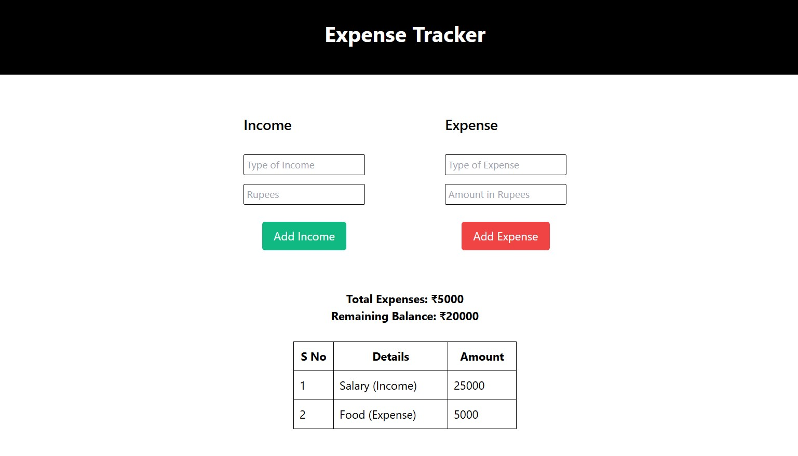

**#Expense Tracker**

A simple and intuitive Expense Tracker application that helps you keep track of your income and expenses. 
Built using HTML, CSS (Tailwind), and JavaScript, this project dynamically displays transaction entries and calculates the remaining balance based on your inputs.

**#Features**
Add Income and Expense Entries: Enter the type and amount for income and expenses.
Real-Time Calculation: Updates the remaining balance and total expenses as you add entries.
Transaction Table: Shows each transaction with a serial number, description, and amount.
Clear, Responsive Design: Built with Tailwind CSS, the application adjusts to different screen sizes for easy mobile use.
Technologies Used
HTML - For structuring the content.
CSS (Tailwind) - For styling and responsive layout.
JavaScript - This is for dynamically adding and calculating entries.
